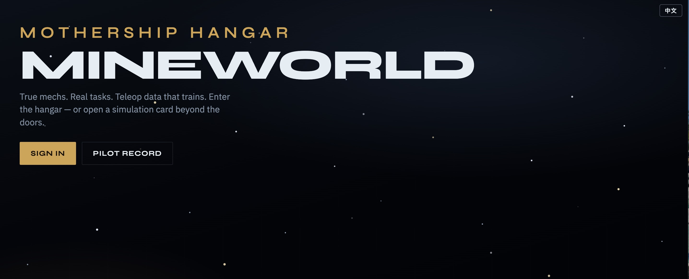
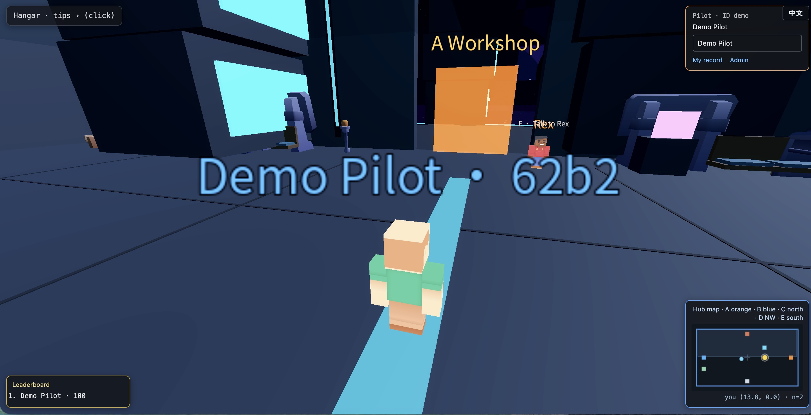
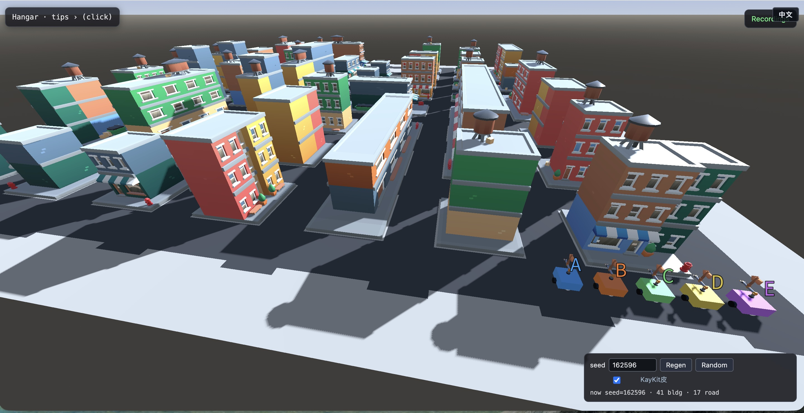

# MineWorld

**开源本地模式**：Godot 编关 + 无头 MuJoCo 机甲权威 + WebSocket 桥，用游戏壳采集可训练的人类遥操数据。

[English README](README.md)

| | |
|--|--|
| **本仓是什么** | 可克隆、可本机跑通的母港 + 工坊/训练场 Demo |
| **本仓不是什么** | 托管 SaaS；商业品牌仅在私有部署时注入 |
| **技术栈** | Godot 4 表现 · MuJoCo 权威 · Python 网关 · 可选 Portal 登录 |
| **文档 SSOT** | [docs/09-todo.md](docs/09-todo.md) · [docs/19-changelog.md](docs/19-changelog.md) |

---

## 本地模式一览

<p align="center">
  
</p>

<p align="center">
  
</p>

<p align="center">
  
</p>

| 画面 | 文件 |
|------|------|
| 落地页（开源默认文案） | `screenshots/frontpage.jpg` |
| 母港大厅 | `screenshots/entry.jpg` |
| 母港外景 | `screenshots/overall.jpg` |
| 训练场 | `screenshots/playground.jpg` · `playground2.jpg` |
| 工坊 | `screenshots/workshop.jpg` |
| 街区细节 | `screenshots/hell.jpg` |

**开源落地页默认**：角标 **机甲学院母港**，页脚 `© 2026 Bug Copyright 云端机甲学院`，**无** ICP。公网「数聚球」品牌与备案号仅在部署机用私有脚本注入，**不进本仓库**。

---

## 五分钟本地 Web

```bash
python -m venv .venv && source .venv/bin/activate
pip install -r gateway/requirements.txt

# 终端 A
.venv/bin/python gateway/echo_server.py --physics mujoco

bash scripts/export_godot.sh web   # 需 Godot 4.7 + Web 导出模板

# 终端 B
bash scripts/serve_web.sh restart
# → http://127.0.0.1:8080/portal/   （demo / demo）
# → 母港 http://127.0.0.1:8080/
```

母港操作：**WASD** 移动 · **QE** 转向 · **V** 切相机（默认**身后跟随** chase）· **F** 交互 · 门进工坊/训练场。

```bash
.venv/bin/python scripts/ws_smoke_test.py
.venv/bin/python scripts/platform_smoke.py
```

编辑器：`godot --path godot/spike`。

---

## 架构（极简）

```text
浏览器 / Godot  ──cmd──►  Gateway（Hub=FakeMech；关卡=MuJoCo）
                ◄─state──
```

细节：[docs/01-architecture.md](docs/01-architecture.md) · [docs/14-godot-mujoco-fusion.md](docs/14-godot-mujoco-fusion.md)

纠偏与 V 线：[docs/15-course-correction.md](docs/15-course-correction.md) · [docs/16-value-sprint.md](docs/16-value-sprint.md)

---

## 许可与素材

第三方资源须 **CC0/MIT**，并在对应 `ASSETS.md` 记账。私有运维与品牌注入（`*.local.md` / `*.local.py`）已 gitignore，勿强制加入提交。
