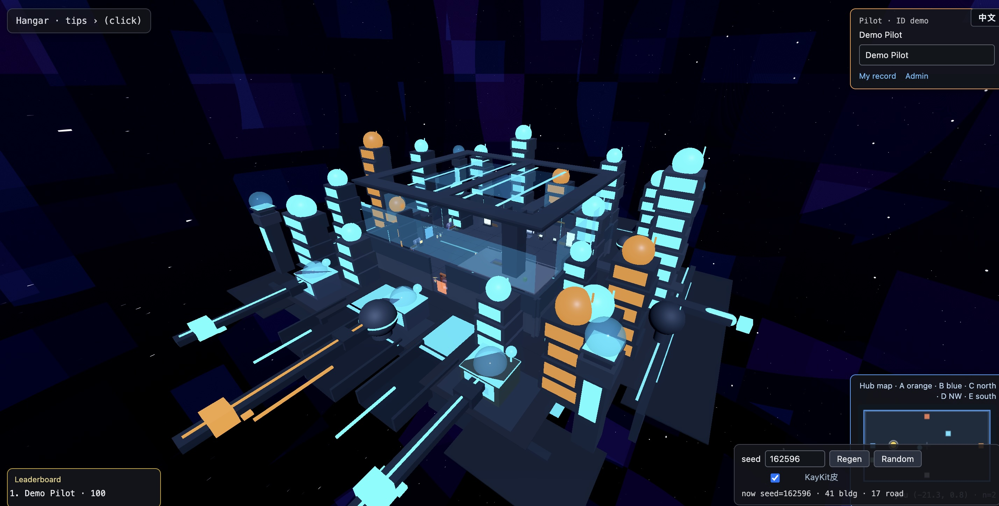

# MineWorld

**Open-source local mode** for Godot + MuJoCo teleoperation: edit worlds in Godot, simulate mechs with headless MuJoCo, bridge over WebSocket, and capture trainable human demos.

[中文说明](README-cn.md)

| | |
|--|--|
| **What this repo is** | A runnable hangar + workshop/city demo you can clone and run on your machine |
| **What it is not** | A hosted SaaS; commercial branding is injected only on private deploys |
| **Stack** | Godot 4 viewer · MuJoCo authority · Python gateway · optional Portal login |
| **Docs (Chinese SSOT)** | [docs/09-todo.md](docs/09-todo.md) · [docs/19-changelog.md](docs/19-changelog.md) |

---

## Local mode in one glance

<p align="center">
  
</p>

<p align="center">
  
</p>

<p align="center">
  
</p>

| Screen | File |
|--------|------|
| Landing (open-source defaults) | `screenshots/frontpage.jpg` |
| Hangar Core (multiplayer presence) | `screenshots/entry.jpg` |
| Hangar exterior | `screenshots/overall.jpg` |
| Training yard (city) | `screenshots/playground.jpg` · `playground2.jpg` |
| Workshop | `screenshots/workshop.jpg` |
| City block detail | `screenshots/hell.jpg` |

**Open-source landing defaults** (no private inject): brand **Mech Academy Hangar / 机甲学院母港**, footer `© 2026 Bug Copyright 云端机甲学院`, no ICP line. Hosted playgrounds may inject different branding after deploy — that script is **not** in this repository.

---

## 5-minute local Web demo

```bash
python -m venv .venv && source .venv/bin/activate
pip install -r gateway/requirements.txt

# Terminal A — physics authority
.venv/bin/python gateway/echo_server.py --physics mujoco

# Export Godot Web (needs Godot 4.7 + Web export templates)
bash scripts/export_godot.sh web

# Terminal B — static + Portal + COOP/COEP
bash scripts/serve_web.sh restart
# → http://127.0.0.1:8080/portal/   (sign in: demo / demo)
# → hangar at http://127.0.0.1:8080/
```

Controls (hangar): **WASD** move · **QE** turn · **V** cycle camera (default is first-person) · **F** interact · doors to Workshop / Training.

Smoke:

```bash
.venv/bin/python scripts/ws_smoke_test.py
.venv/bin/python scripts/platform_smoke.py
```

Editor preview: `godot --path godot/spike` (default scene is the Hub).

---

## Architecture (short)

```text
Browser / Godot  ──cmd──►  Gateway (FakeMech on Hub, MuJoCo on play levels)
                 ◄─state──
```

- **Hub**: presence only (no MuJoCo) — walk, see others, enter doors  
- **Workshop / City**: MuJoCo-authoritative mechs; teleop + recordings for IL  
- Schemas under `schemas/`; contracts under `examples/contracts/`

More: [docs/01-architecture.md](docs/01-architecture.md) · [docs/14-godot-mujoco-fusion.md](docs/14-godot-mujoco-fusion.md)

---

## Repo layout

```
mineworld/
├── README.md / README-cn.md
├── screenshots/          # local-mode gallery
├── docs/                 # design SSOT (Chinese)
├── godot/spike/          # Godot client + web shell / portal
├── gateway/              # WebSocket + MuJoCo / FakeMech
├── mujoco/               # MJCF + headless scripts
├── mw_platform/          # identity / scores API (SQLite)
├── schemas/ · examples/ · scripts/
└── dist/                 # export output (gitignored)
```

---

## License & assets

Third-party art must stay **CC0 / MIT** with an `ASSETS.md` ledger entry (see Kenney / KayKit packs under `godot/spike/assets/`). Do not commit NC/SA content.

Private ops notes and branding inject scripts (`*.local.md` / `*.local.py`) are gitignored on purpose.
